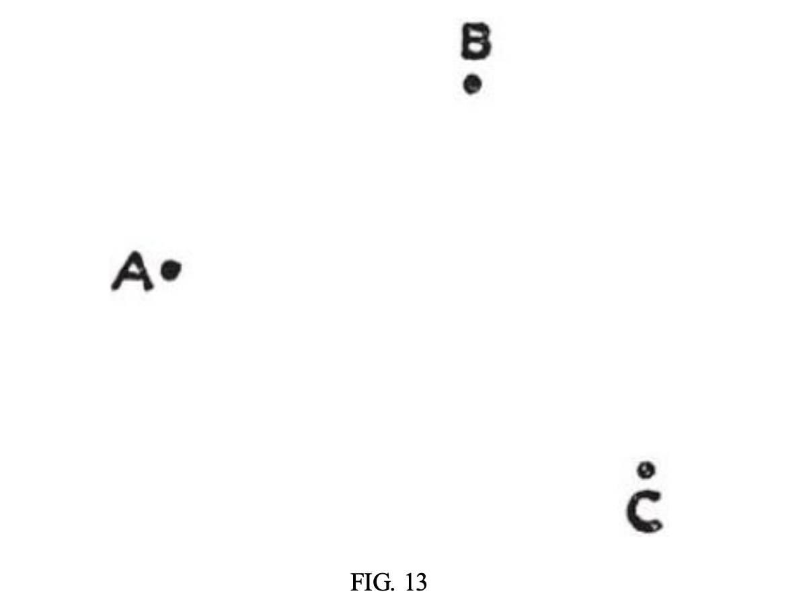

+++
title = "자료에서 유용한 것을 찾아보자"
categories = ["Planning"]
tags = ["HowToSolveIt"]
weight= 6
+++

# **자료에서 유용한 것을 찾아보자**

### 구하려는 것과 자료에 징검 다리를 놓아보자.

### 다리의 시작은 때로는 구하려는 것으로 부터 때로는 자료로 부터 시작돼.



보통은 구하려는 것으로 부터 생각을 시작하는 것이 좋지만 자료로 부터 시작하는 것도 가끔 유용해.

**B** 문제를 생각해 냈지만 2가지 종류의 문제가 있을 수 있어.

- 1. **B** 문제를 어떻게 사용할지는 알겠는데 그 해결 방법을 모르겠는 경우

- 2. **B** 문제를 어떻게 활용할 지 모르는 경우
     
